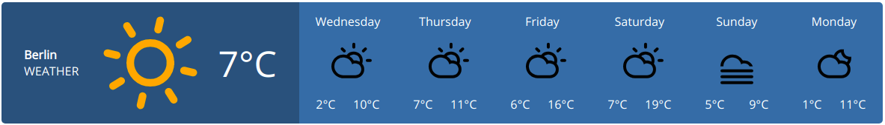

# WeatherWidget

    

Preview: [peter-stuhlmann-webentwicklung.de/weather](https://peter-stuhlmann-webentwicklung.de/weather)

Dark Sky API Documentation: [https://darksky.net/dev/docs](https://darksky.net/dev/docs)

---

[&copy; Peter R. Stuhlmann Webentwicklung](https://peter-stuhlmann-webentwicklung.de)